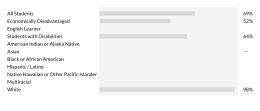
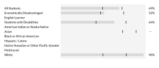

## Customized interactive web reports

### Why use custom CSS and JavaScript when Quarto has built-in interactivity?

Quarto provides many interactive features out of the box that are useful in creating web reports such as tabsets, table of contents, and support for interactive widgets like callouts, collapsible blocks, cards etc. However, incorporating CSS and JavaScript allows you to develop reports with custom interactivity and dynamic behaviors that go beyond the built-in options. For example, you can create custom dropdowns, tooltips, and visualizations that respond to user input in real time.

Quarto uses Bootstrap 5 for rendering HTML documents. This opens a pathway to enhance some of Quarto's built-in interactive features, which are based on Bootstrap, and also leverage additional Bootstrap components like dropdowns, buttons, accordions, and tooltips.

> **What is Bootstrap?** Bootstrap is a front-end framework designed for building responsive websites, using a combination of HTML, CSS, and JavaScript components. It exposes various CSS classes that can be used as-is or customized per a user's requirements. With JavaScript, you can add dynamic features to your Bootstrap CSS components and have more fine-grained control over how the interactive elements work in your Quarto report. 

By combining Quarto's document authoring capabilities with custom CSS and JavaScript, you can deliver highly responsive and tailored web reports for your audience.

## Examples

### Two-Column Grid with an Interactive Dropdown Button {#interactive-dropdown}

::::{.sample-grid}
:::{.col1}
This is a grid column with sample text.
:::

:::{.col2}
Click button for dropdown options.

<button class="arrow-toggle" data-bs-toggle="collapse" data-bs-target="#collapse-1" aria-expanded="false" aria-controls="collapse-1">
    <svg class="chevron-icon"><use href="#icon-chevron-down"></use></svg>
</button>

:::
::::

:::: {.collapse .attached-collapse id="collapse-1"}
<p>Dropdown content goes here.</p>
::::

<br>

1. **Define the grid layout**
- An outer container is defined using `.sample-grid` CSS class which contains two columnar sections, `.col1` and `.col2`.

2. **Create an icon for dropdown arrow**
- [Font Awesome](https://fontawesome.com/) is used to create the chevron icons (both upwards and downwards) for the dropdown button.
- The SVG symbol is defined in the `<svg>` block within the `include-in-header` section of the Quarto YAML front matter and can be identified globally using the `id` attribute (e.g., `icon-chevron-down`).

3. **Add a toggle button**
- A custom `.arrow-toggle` class is used to style the button in the second column (`.col2`).
- The button uses Bootstrap's `data-bs-toggle="collapse"` and `data-bs-target="#collapse-1"` attributes to toggle the visibility of the dropdown content using built-in JavaScript functionality.
- `aria-expanded` attribute controls whether dropdown is expanded (`true`) or collapsed (`false`). The button also includes `aria-controls` attribute containing the `id` of the collapsible element (e.g., `"collapse-1"`).
- The button has an SVG chevron icon (`.chevron-icon`) that visually indicates toggle state to the end user.
- Chevron icon's SVG symbol is instantiated by the `<use>` element containing the `href` attribute pointed to the `id` of the symbol defined earlier (e.g., `#icon-chevron-down`).

4. **Define collapsible content**
- The collapsible content is referenced with classes `.collapse` (in-built) and `.attached-collapse` (for styling).
- `id="collapse-1"` matches the button's `data-bs-target` attribute so that when button is clicked, content in this block is toggled.

5. **Control interactivity with custom JavaScript**
- A JavaScript file containing customized functions to control CSS elements is added to the `include-in-header` section of the Quarto YAML front matter.
- Whenever button (i.e. chevron icon) is clicked, custom JavaScript automatically changes the chevron icon (from up to down and vice versa) to show the toggle state of the collapsible element. 


### Accordion-style dropdown with button

```{python}
from IPython.display import display, Markdown

def generate_cards(n=3):
    """
    Generates `n` number of `.card` HTML elements.
    """
    for i in range(n):

        display_md = f"""
::: {{.card .custom-card id="card-{i+1}"}}
<strong>Card {i+1}</strong>
<p>This is a sample card.</p>

<a href="#" data-bs-toggle="collapse" data-bs-target="#additional-collapse-{i+1}" aria-expanded="false" aria-controls="additional-collapse-{i+1}" class="measure-link">Click here to see more details.</a>

:::{{.collapse id="additional-collapse-{i+1}"}}
<p>Additional content for Card {i+1} goes here.</p>
:::

:::
"""
        display(Markdown(display_md))
```


::::{.sample-grid}
:::{.col1}
This is a grid column with sample text.
:::

:::{.col2}
Click button for dropdown options.

<button class="arrow-toggle" data-bs-toggle="collapse" data-bs-target="#collapse-2" aria-expanded="false" aria-controls="collapse-2">
    <svg class="chevron-icon"><use href="#icon-chevron-down"></use></svg>
</button>

:::
::::

:::: {.collapse .attached-collapse id="collapse-2"}

```{python}
generate_cards()
```
::::

<br>

1. **Create dropdown button hiding a collapsible element**
- Follow the steps detailed in (example 2.1)[#interactive-dropdown] above.

2. **Add accordion style collapsible element**
- For the collaspible element with `id="collapse-2"`, multiple accordion style `.card` elements are created using a Python function.
- `generate_cards()` function creates `n` Quarto `.card` elements which are styled using `custom-card` class.
- Within each card element, an additional Bootstrap based collapse is added using the hyperlink `<a>` tag containing    `data-bs-toggle="collapse"` and `data-bs-target` attributes. 
- In `generate_cards()` function, the `display` function from `IPython.display` is used to render the generated Markdown in the Quarto document.

### Custom tooltip with overlay

::::{.sample-grid-2}
This is an informative tooltip.

<span class="custom-tooltip">
  <span class="custom-tooltip-trigger">
    <svg><use href="#icon-info-circle"></use></svg>
  </span>
  <span class="custom-tooltiptext">
    <span class="custom-tooltip-close">✖</span>
    <strong>Tooltip Text</strong><p>This sample text is displayed when tooltip icon is clicked. Click on the cross button to close the tooltip.</p>    
  </span>
</span>

::::

<div class="tooltip-overlay"></div>

<br> 

1. **Define the grid layout**
- An outer container is defined using `.sample-grid-2` CSS class.

2. **Create custom tooltip**
- The tooltip is styled using `custom-tooltip` class.
- The `custom-tooltip-trigger` class contains an SVG icon, `icon-info-circle`, which acts as the clickable element to display the tooltip content.
- The tooltip content is defined within the `custom-tooltiptext` element which is configured to be hidden by default using CSS. When user clicks the trigger icon then the content inside  `custom-tooltiptext` becomes visible.
- A close button (`custom-tooltip-close`) is included within the tooltip text which allows the user to close the tooltip when it's visible.

3. **Add an overlay**
- Whenever tooltip is displayed, the background is greyed out by adding an overlay using the custom `tooltip-overlay` class.
- The tooltip overlay is otherwise hidden by default.

4. **Control interactivity with custom JavaScript**
- A JavaScript file containing customized functions to control CSS elements is added to the `include-in-header` section of the Quarto YAML front matter.
- Whenever tooltip icon (i.e. chevron icon) is clicked, custom JavaScript code is triggered which displays the `custom-tooltiptext` content and adds an overlay to the rest of the screen.
- User is able to then click on the close element (`custom-tooltip-close`) within the tooltip content box which triggers JavaScript to hide the tooltip text box and the screen overlay is removed as well.

> **Note:** The HTML elements present in the `include-in-header` section can also be defined globally in the `qmd` file.

### Toggle button

::::{.sample-grid-2 style="display: block"}

<span>
    <button class="btn chart-toggle" type="button" data-toggle-id="1">
        <svg class="chart-toggle-button"><use href="#icon-toggle-on"></use></svg>
    </button>
    <span class="chart-button-text" id="turn-on-text-1" style="display: none;">Turn on floors and targets</span>
    <span class="chart-button-text" id="turn-off-text-1" style="display: inline ;">Turn off floors and targets</span>
</span>

<!-- Load locally stored chart image with/without floors and targets-->         


::::

1. **Define the grid layout**
- An outer container is defined using `.sample-grid-2` CSS class.

2. **Create custom toggle**
- The toggle is a button styled using `chart-toggle`, containing an SVG icon. It exposes a data attribute (`data-toggle-id`) identifying the chart controlled by the toggle and linking the button to corresponding images and button state text.
- `chart-button-text` class is used to style the informative text displayed with the toggle button that indicates the toggle state. An `id` attribute is added to the `<span>` containing this class so that JavaScript code can identify and control the text displayed given the toggle button's state.

3. **Add images to be toggled**
- Two `` tags are defined containing bar chart images with and without floors & targets. 
- An `id` attribute is added to the images so that JavaScript code can identify the image to display based on the toggle button state. `id="turn-on-text-1"`  contains a reference to the ID value in `data-toggle-id="1"`. All button related IDs reference `data-toggle-id="1"` for continuity.

4. **Control interactivity with custom JavaScript**
-  A JavaScript file containing customized functions to control CSS elements is added to the `include-in-header` section of the Quarto YAML front matter.
- Whenever `chart-toggle` button is clicked, custom JavaScript code is triggered to identify whether the toggle button is turned off using the `#icon-toggle-off` class.
- By default, the HTML is set up to turn the toggle button on, display informative text "Turn off floors and targets", and show the sample chart image with floors and targets.
- If toggle button is clicked turning it off then JavaScript code triggers display of informative text "Turn on floors and targets" and a sample chart image without floors & targets.
- If the toggle button is clicked and its state changes from off to on, then JavaScript automatically switches the informative text and image displayed.
- The HTML and JavaScript code is designed to work in tandem using the HTML attribute `data-toggle-id` which JavaScript accesses using `this.dataset.toggleId` attribute. 
- By associating a toggle button with a unique `data-toggle-id` ID and using the ID to identify its related elements, we can control the interactivity of these elements through JavaScript.

> **Note:** The `data-toggle-id` attribute is a user defined 1`data-*` attribute and is accessible as a `element.dataset.toggleId` element by JavaScript (hyphenated names map to camelCase).